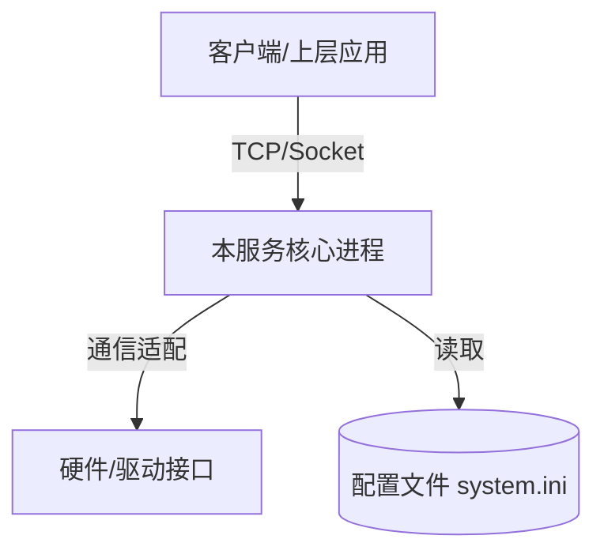
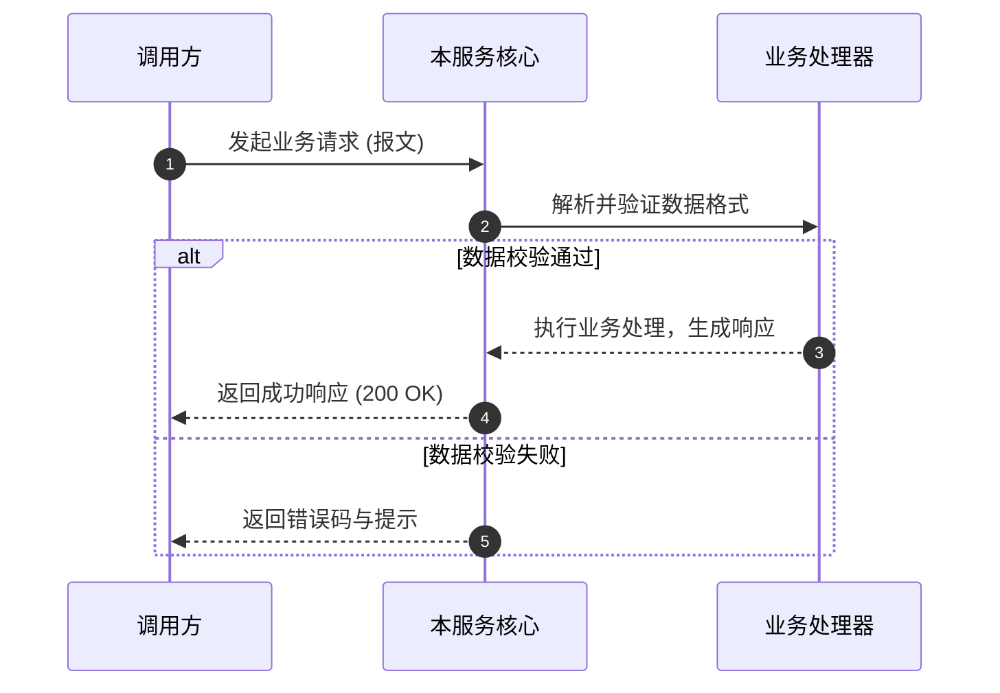

# 概要设计与系统架构：[系统/模块名称]

## 1. 架构全景与定位
- **系统定位**：本模块在整体系统中的角色分工（如：作为安全通信守护进程、数据采集前置等）。
- **设计原则**：[如：高内聚低耦合、零外部未受控依赖、断线自动重连]

## 2. 核心模块与职责划分
| 模块名称 | 对应源码路径 | 核心职责 |
| :--- | :--- | :--- |
| `[子模块 A]` | `apps/xxx/module_a/` | [职责说明，如：连接管理、心跳保活] |
| `[子模块 B]` | `apps/xxx/module_b/` | [职责说明，如：协议编解码、加解密] |

## 3. 关键业务流程与时序图

## 4. 架构决策与权衡 (ADR 摘要)
- **技术选型理由**：[为何采用当前方案，例如采用 Qt 事件循环还是原生 epoll]
- **放弃的备选方案**：[说明备选方案及放弃原因]
- **已知技术债务与约束**：[如：单线程阻塞风险、平台特定工具链限制]
